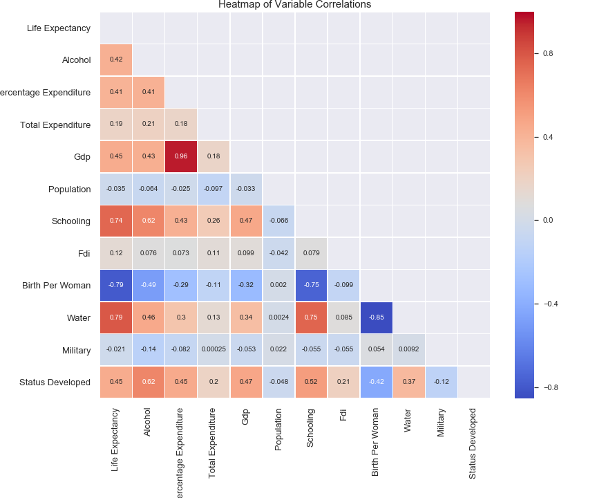
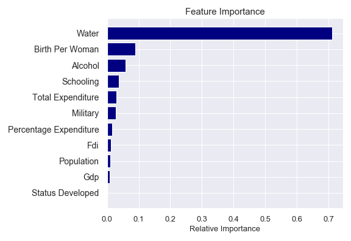
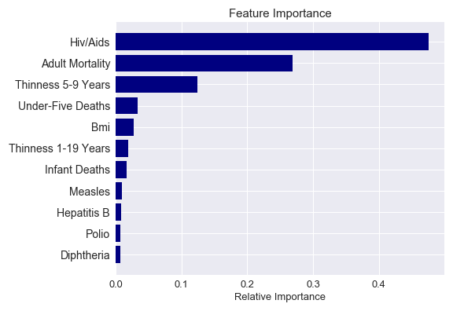

# final_project
Tableau Workbook link: https://public.tableau.com/profile/sreeteja#!/vizhome/FinalProject_15889958372040/Story1

## Project Summary

In our project we wanted to look at different types of variables and their affect on life expectancy. We used data from WHO, World Bank, and United Nations. We grouped the data by country and year and looked at the date range 2000 - 2015.

2015 Life Expectancy by Country:

## Trends in the Data and Random Forest Modeling

Non-Health Variables:

Above is our heatmap of variable correlations and our random forest feature importance (standardized variables).

By far access to water was the highest correlated and highest ranked feature by our random forest model. This is expected as access to water is critical to human survival. For the rest of the variables we saw that general lifestyle and social variables (births per woman, alcohol intake per capita) ranked higher in correlation as well as feature importance than economic variables. We felt that the lifestyle variable may not necessarily have a causal relationship with life expectancy but may be related to developed versus developing countries lifestyle. For example developed countries have on average 1.4 births per woman and developing countries have an average 3.1 births per woman. It was interesting even the economic variables directly related to health did not rank high in the random forest feature importance. For example percent expenditure which is spend on health as a percent of GDP was ranked lower than all social variables.

Our random forest model score was very high at .91. We tested taking water out to see its effect on our model but the accuracy only dropped to .88.

Health Variables: 

Above is our heatmap of variable correlations and our random forest feature importance (standardized variables).

For health related variables we expected mortality rates to have a high correlation with life expectancy but found it interesting that hiv/aids deaths during birth (per 1,000 people) had a higher correlation than infant deaths and under 5 deaths.  We also expected that vaccination rates of one-year-olds (Polio, Hepatitis B, and Diphtheria)  would have higher correlations to life expectancy. But when digging into the data we saw that there are large groups of countries that have near 100% vaccination rates but varying life expectancy values. 

Our random forest had a high score of .94. This was expected from the types of variables we used in this model. We were more interested in the importance of each variable and found it interesting that Hiv/aids was a higher ranked factor than adult mortality. For us to use this particular model in predicting we would first take out the variables that had high colinearity or actually overlapped in what they measured for example infant deaths and under 5 deaths. 

## Model

After exploring the variety of variables and the ways different variables correlate with average life expectancy, we try to create a model to predict average life expectancy. We wanted the most efficient model, and the simplest approach was creating a multivariate regression model. We want to find the most effective combination of variables rather than including all of the variables we explored in our model. Knowing that adding to the variable count tend to always increase the r-squared value, to find the most effective, we looped all the variables into different combinations and organized the results by largest training score to find the most effective variables combination in correlating with average life expectancy.

The results of the different multivariate regression models through each combination of variables were inconsistent. While the result of the 4 variable multivariate regression model yield high r-squared values, the models' variables' coefficient didn’t match the nature of the previous correlation.

Below are two models with relatively high r-squared values between .84 and .86.
1.	Ave. Life Expectancy = 46.894+Adult Mortality*-0.016+Water*-0.480+Schooling*1.073+Hiv&Aids*0.159
2.	Ave. Life Expectancy = 46.894+Adult Mortality*-0.017+Birth Per Woman*-2.079+Schooling*-0.453+Hiv&Aids*0.972

(For the whole list please reference: regressions/multilinear4_all.csv for 4 variable multivariate regression and regressions/multilinear3_all.csv for 3 variable multivariate regression).

These models with the highest scoring r-squared value, but the conclusions were somewhat counter-intuitive. For example, if we were to rely on the first model, if the percentage of people with water access increase by 10%, the average life expectancy would decrease by half a year. If we were to rely on the second model to predict average life expectancy, the model would state that an increase in schooling variable by one year would decrease the average life expectancy by half a year. Similar counter-intuitive patterns can be found with the 3 variables multivariate regression models with the highest r-squared values. These counter-intuitive patterns while being logically nonsensically, but also differ in the patterns found in the previous data exploration. Water and schooling were both found to have positive correlation with average life expectancy. 

With the perplexing results, we put aside the previous models and try to find inherent factors about the certain parts of the dataset that might skew different results then the rest. According to previous data exploration, we decided divide the datasets based on the country’s development status.

The countries with the highest average life expectancy were all developed countries, and the countries with the lowest average life expectancy were all developing countries. Do different variables have a different effect on a country depending on whether it is a developed or developing country? While we did measure "status developed" in the model, since it was a binary variable, it didn't allow variation which might have been why the correlation for that specific variable wasn’t really high. It was worth looking to see if models generated from developing countries' data different than the models generated by developed countries' data.

The other factor we considered is the type of variable. Looking at the previous exploration through the lens of health vs non-health data, different variable combinations seemed to generate different correlations. By containing the types of variables within the regression models, we try to find patterns between the variables.

Below is a small sample of the models generated with only developed countries' data.
The r-squared value ranged between 0.81 and 0.84.

1.	Ave. Life Expectancy = 64.212+Birth Per Woman*-2.420+Schooling*-0.673+Hiv/Aids*1.119
2.	Ave. Life Expectancy = 53.4359+Adult Mortality*-0.018+Water*-0.401+Thinness 5-9 Years*-0.346+Hiv/Aids*0.258

(For the whole list please reference: regressions/multilinear4_develped.csv)

Below is a small sample of models generated from the data of developing countries.
The r-squared value ranged between 0.84 and 0.85.

1.	Ave. Life Expectancy = 67.137+Adult Mortality*-0.018+Birth Per Woman*-2.02+Schooling*-0.451+Hiv/Aids*1.000
2.	Ave. Life Expectancy = 47.124+Adult Mortality*-0.018+Water*-0.456+Schooling*0.987+Hiv/Aids*0.17

(For the whole list please reference: regressions/multilinear4_develping.csv).

While inconsistencies still existed, there were some consistent aspects to these models. Overall, the models with the highest r-squared values have coefficients that align uniformly across the models, but the variable with consistent coefficient differed the models featuring the developed countries’ data and the models with the developing countries’ data. The variables to measure water and schooling were consistently negative in the models generated from the developed countries’ data. Birth per woman was consistently negative in the models generated from the developing countries’ data. This differ possibility shows merit in making the development status an important consideration when creating the model.

While these models’ r-squared values are relatively high, further exploration with possible more diverse variables would create a more dependable model to predict the  average life expectancy of a country.

## Findings
 Overall throughout our models we found that adult mortality, Hiv/Aids, bmi, births per woman, water, schooling were key variables in predicting life expectancy. We expected variables like adult mortality and water to be important variables but were surprised by the social variables like births per woman and schooling.
 
 We’d like to find better methods to optimize and compare models in the future. We are new to machine learning but definitely learned a lot through testing these models.

