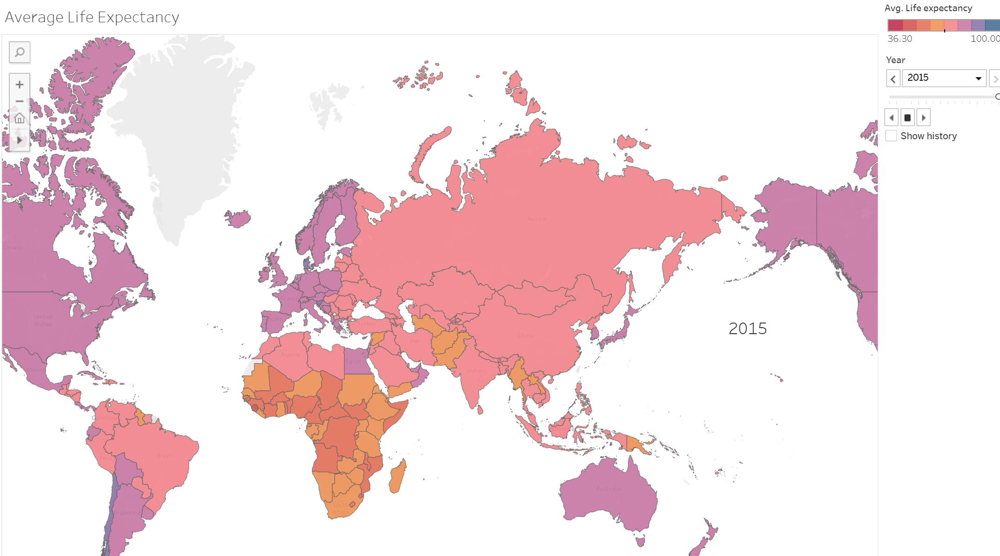
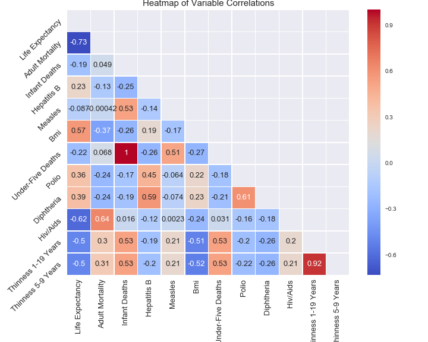

# final_project
Tableau Workbook link: https://public.tableau.com/profile/sreeteja#!/vizhome/FinalProject_15889958372040/Story1

## Project Summary

In our project we wanted to look at different types of variables and their affect on life expectancy. We used data from WHO, World Bank, and United Nations. We grouped the data by country and year and looked at the date range 2000 - 2015.

2015 Life Expectancy by Country:

## Trends in the Data and Random Forest Modeling

Non-Health Variables:

Above is our heatmap of variable correlations and our random forest feature importance (standardized variables).

By far access to water was the highest correlated and highest ranked feature by our random forest model. This is expected as access to water is critical to human survival. For the rest of the variables we saw that general lifestyle and social variables (births per woman, alcohol) ranked higher in correlation as well as feature importance than economic variables. We felt that the lifestyle variable may not necessarily have a causal relationship with life expectancy but may be related to developed versus developing countries lifestyle. For example developed countries have on average 1.4 births per woman and developing countries have an average 3.1 births per woman. It was interesting even the economic variables directly related to health did not rank high in the random forest feature importance. For example percent expenditure which is spend on health as a percent of GDP was ranked lower than all social variables.

Our random forest model score was very high at .91. We tested taking water out to see its effect on our model but the accuracy only dropped to .88.

Health Variables: 

Above is our heatmap of variable correlations and our random forest feature importance (standardized variables).

## Findings
 Overall throughout our models we found that adult mortality, Hiv/Aids, bmi, births per woman, water, schooling were key variables in predicting life expectancy. We expected variables like adult mortality and water to be important variables but were surprised by the social variables like births per woman and schooling.
 
 We’d like to find better methods to optimize and compare models in the future. We are new to machine learning but definitely learned a lot through testing these models.

